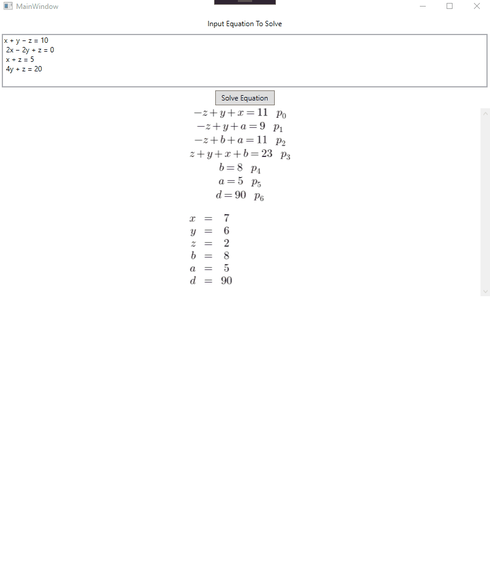

# Linear System Solver

This project provides step by step solver for systems of linear equations using [Gaussian elimination](https://en.wikipedia.org/wiki/Gaussian_elimination).

Demo GUI:

**Disclaimer:** The project was created for educational purpose and none of it should be taken very seriously. Besides C#
is a terrible language for this type of project.
